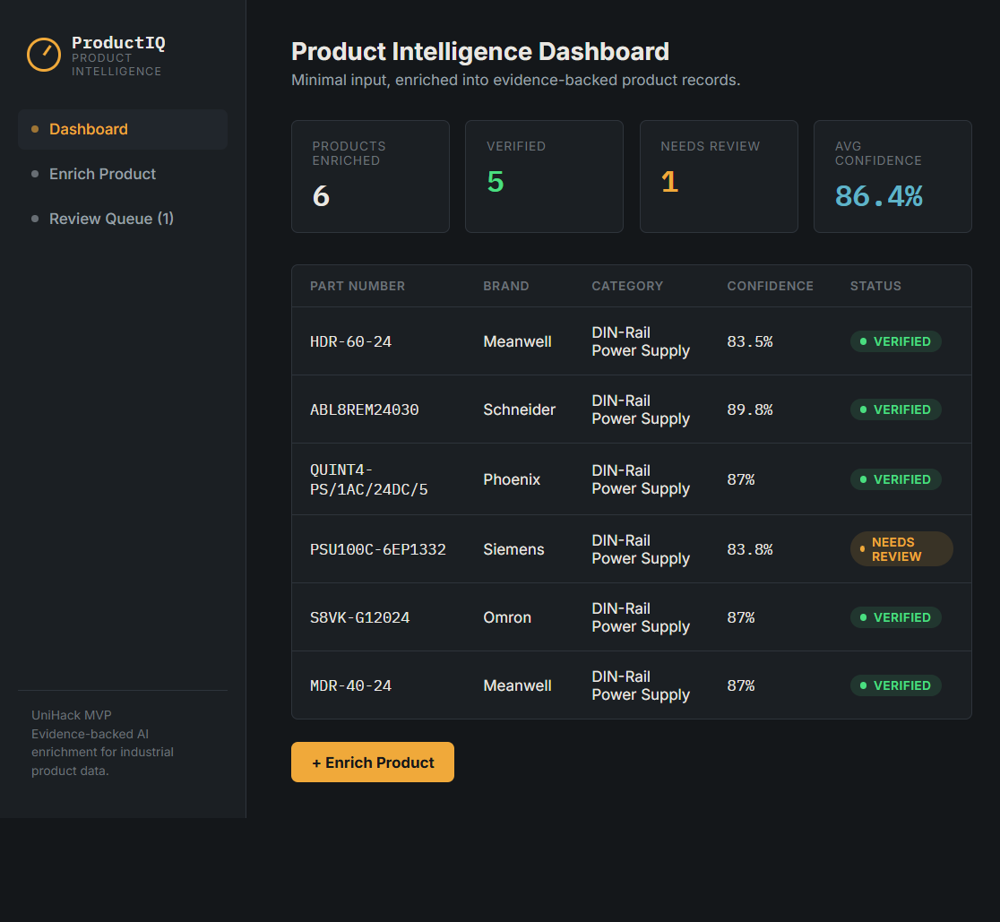
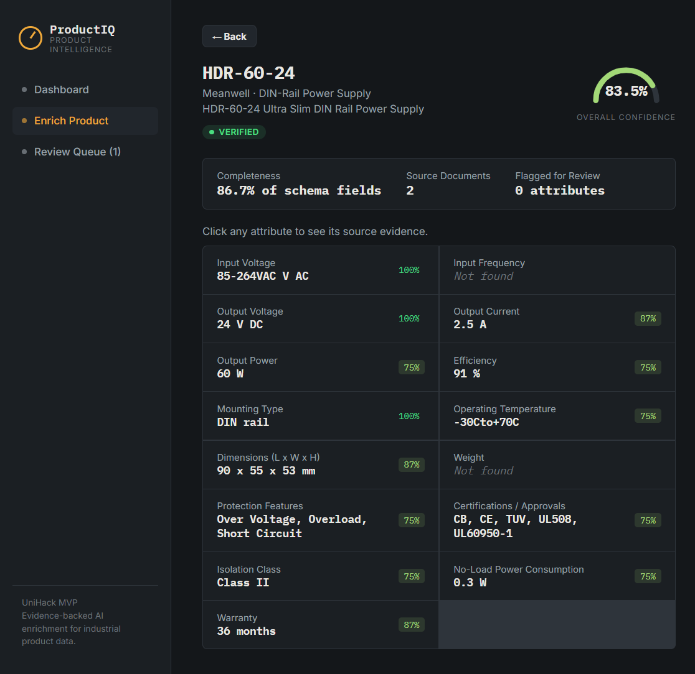
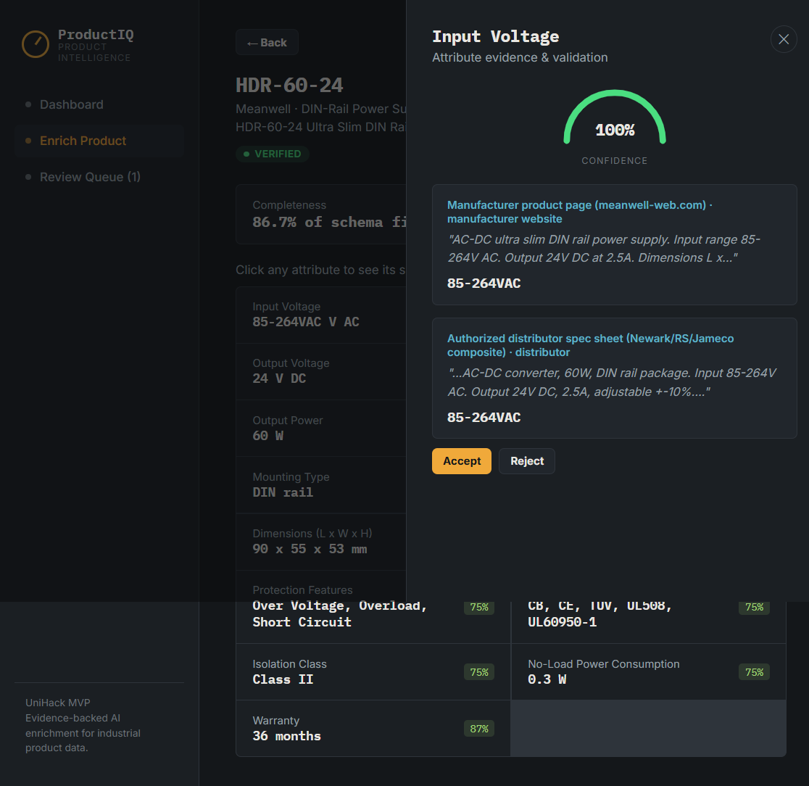

# ProductIQ — AI-Powered Product Intelligence & Enrichment Platform

Built for the UniHack "AI Product Intelligence for Industrial Commerce" challenge.

Takes minimal product input (Part Number + Brand + Short Description) and produces
a structured, **evidence-backed** product record — every generated attribute carries
its source document, the exact evidence snippet, and a confidence score. No source →
no fact.

## Why this architecture

The brief explicitly warns against a "chatbot that generates product descriptions."
The judging criteria (accuracy, quality, scalability, innovation — equal weight) all
point the same direction: an LLM alone can't be trusted to invent specifications, so
the system is built as a **pipeline**, not a single prompt:

```
Minimal Input (part#, brand, description)
        │
        ▼
Normalize (brand alias collapsing)
        │
        ▼
Source Discovery         → seeded manufacturer/distributor documents (Phase 3 stub;
        │                   swap for live web/PDF crawl in production)
        ▼
Document Processing      → per-source text
        │
        ▼
AI Extraction             → app/services/extraction.py
        │                   (deterministic pattern extraction today;
        │                    llm_extract_stub() is the drop-in slot for a real LLM call)
        ▼
Multi-source Validation   → app/services/validation.py
        │                   detects agreement vs conflict across sources,
        │                   prefers manufacturer sources on conflict
        ▼
Confidence Scoring        → reliability + agreement + extraction certainty + rule checks
        │
        ▼
Human Review Queue        → low-confidence / conflicting attributes surfaced,
        │                   never silently guessed
        ▼
Enriched Product Record   → 15-attribute canonical schema (app/data/schema.py),
                             analogous to Unilog's 252-column output template
```

## What's implemented (MVP scope)

- **Category:** DIN-rail power supplies (Schneider, Siemens, Phoenix Contact, Mean
  Well, Omron) — one focused category, per the plan, to keep the demo coherent.
- **6 seed products**, each with 1-3 captured source documents (manufacturer site,
  distributor listing, third-party DB). One product (Siemens SITOP) deliberately has
  a conflicting weight value across two sources, to demonstrate the conflict-detection
  and review-queue path end to end.
- **15-attribute schema** with unit, source, evidence, and confidence per field
  (`app/data/schema.py`).
- **Working pipeline**: normalization → extraction → validation → confidence scoring
  → review queue, fully testable with zero external API keys.
- **5-screen React frontend**: Dashboard, Enrich Product, Processing, Product Profile
  with an evidence drawer, and a Human Review Queue.

## What's a stub (by design, for a hackathon MVP)

- **Source discovery** (Phase 3) is seeded, not a live crawler — `SEED_PRODUCTS` in
  `app/data/seed_products.py` stands in for "go find the manufacturer page/PDF."
  Swapping this for live search + PDF/OCR ingestion doesn't change anything
  downstream — the pipeline already treats "a document with text" as its unit of input.
- **AI extraction** currently uses deterministic regex extraction so the whole thing
  runs offline. `llm_extract_stub()` in `extraction.py` is the exact seam to plug in
  a real LLM (Anthropic/OpenAI) for production — same input/output contract.
- **RAG / vector store**: not needed at this seed-document scale (a handful of short
  snippets per product); the natural next step at catalog scale is chunking +
  embeddings + a vector DB (Chroma/pgvector) feeding the same extraction contract.

## Run it

```bash
./start.sh
# backend:  http://localhost:8000/api
# frontend: http://localhost:5173
```

Or manually:

```bash
# backend
cd backend
pip install -r requirements.txt --break-system-packages   # or use a venv
python3 -m uvicorn app.main:app --reload --port 8000

# frontend (separate terminal)
cd frontend
npm install
npm run dev
```

## API

| Method | Path                                   | Purpose                              |
|--------|-----------------------------------------|---------------------------------------|
| GET    | `/api/products`                         | Dashboard: all products, enriched     |
| GET    | `/api/products/candidates`              | Un-enriched input rows (picker)       |
| POST   | `/api/products/{id}/enrich`             | Run the pipeline for one product      |
| GET    | `/api/products/{id}`                    | Full enriched product record          |
| GET    | `/api/review-queue`                     | Flagged attributes across all products|
| POST   | `/api/review/{id}/{attribute}`          | Accept / reject / edit a flagged value|

## Screenshots

**Dashboard** — Overview of all enriched products with confidence scores and verification status:


**Product Profile** — Detailed attribute view with evidence-backed confidence scores. Note the color-coding:
- Green (100%) = verified by all sources
- Light green (75–89%) = high confidence, not perfect
- Amber = needs review / lower confidence
- Red = genuine cross-source conflicts (e.g., Siemens SITOP weight: 600g vs 750g)



**Evidence Drawer** — Click any attribute to view the sources and exact evidence supporting its value:


## Scaling this to Unilog's actual numbers (150K → 750K SKUs/month)

Not built into the MVP (out of scope for a hackathon prototype per the brief's own
FAQ — "a working MVP is sufficient"), but the architecture is designed for it:

- Source Discovery + Document Processing become async workers (Celery/Redis or
  similar), queued per SKU, so throughput scales horizontally.
- Extraction results and embeddings get cached per manufacturer/part-family so
  repeated SKUs from the same product line don't re-pay the LLM cost.
- Cheap/deterministic extraction (regex, rules) runs first; an LLM call is only
  made for attributes that remain unresolved — keeping per-SKU cost bounded, which
  the organizers flagged explicitly ("this industry works on thin margins").
- Confidence-based routing: only sub-threshold or conflicting attributes reach the
  human review queue, keeping human effort proportional to actual uncertainty
  rather than every field of every SKU.

## Next steps (in priority order)

1. Wire `llm_extract_stub()` to a real LLM for attributes the regex layer misses
   (long-tail phrasing, non-numeric facts like applications/features).
2. Replace `seed_products.py` with a live source-discovery step (web search +
   manufacturer-domain preference + PDF ingestion via PyMuPDF).
3. Add bulk CSV upload → batch enrichment → CSV export, matching Unilog's actual
   input/output workflow.
4. Persist to a real database (SQLite/Postgres) instead of the in-memory cache.
